> **Note:** This diagram predates the Parcelled and Compiled stages (March 2026). For the current authoritative pipeline reference, see [`docs/pipeline-with-parcelled.md`](pipeline-with-parcelled.md).

# Pipeline Flowchart

```mermaid
flowchart LR

  %% ── Styling ──
  classDef source fill:#e8daef,stroke:#7d3c98,color:#000
  classDef storage fill:#d5f5e3,stroke:#27ae60,color:#000
  classDef engine fill:#d6eaf8,stroke:#2980b9,color:#000
  classDef versioned fill:#fdebd0,stroke:#e67e22,color:#000
  classDef output fill:#fadbd8,stroke:#e74c3c,color:#000
  classDef bypass fill:#f2f3f4,stroke:#95a5a6,color:#555

  %% ══════════════════════════════════════
  %% SOURCE 1: REALTRACK
  %% ══════════════════════════════════════

  subgraph RT_SOURCE ["Realtrack"]
    RT_SITE(("Realtrack.com")):::source
    RT_SCRAPER["cleo scrape"]:::engine
    RT_HTML[("data/html/{type}/*.html<br/>~92,547 files<br/><i>raw HTML saved</i>")]:::storage
    RT_PARSER["cleo parse<br/>--sandbox / --promote"]:::engine
    RT_PARSED[("data/parsed/active/<br/>RT*.json<br/>v001–v014")]:::versioned

    RT_SITE --> RT_SCRAPER --> RT_HTML --> RT_PARSER --> RT_PARSED
  end

  %% ══════════════════════════════════════
  %% SOURCE 2: BRANDS
  %% ══════════════════════════════════════

  subgraph BR_SOURCE ["Brand Scrapers"]
    BR_APIS(("Brand APIs<br/>& Websites")):::source
    BR_SCRAPER["brands/run.py<br/><i>scrape + parse in one step</i><br/><i>no raw HTML saved</i>"]:::engine
    BR_JSON[("brands/data/*.json<br/>~94 brand files<br/>~14,340 stores")]:::storage

    BR_APIS --> BR_SCRAPER --> BR_JSON
  end

  %% ══════════════════════════════════════
  %% SOURCE 3: GEOWAREHOUSE
  %% ══════════════════════════════════════

  subgraph GW_SOURCE ["GeoWarehouse"]
    GW_EXT(("Browser Extension")):::source
    GW_INGEST["cleo gw-ingest"]:::engine
    GW_HTML[("data/gw_html/*.html<br/>~798 files<br/><i>raw HTML saved</i>")]:::storage
    GW_PARSER["cleo gw-parse<br/>--sandbox / --promote"]:::engine
    GW_PARSED[("data/gw_parsed/active/<br/>GW*.json<br/>deduped by PIN")]:::versioned

    GW_EXT --> GW_INGEST --> GW_HTML --> GW_PARSER --> GW_PARSED
  end

  %% ══════════════════════════════════════
  %% BYPASS: Other Data (non-address)
  %% ══════════════════════════════════════

  RT_PARSED -- "Other Data<br/>(price, date, parties,<br/>ARN, brokerage)" --> COMPILER
  GW_PARSED -- "Other Data<br/>(PIN, ARN, zoning,<br/>assessment, sales history)" --> COMPILER

  %% ══════════════════════════════════════
  %% NORMALIZE
  %% ══════════════════════════════════════

  RT_PARSED -- "Addresses" --> NORM
  BR_JSON -- "Addresses" --> NORM
  GW_PARSED -- "Addresses" --> NORM

  NORM["cleo normalize<br/>--sandbox / --promote<br/><i>all 3 sources → single dir</i>"]:::engine
  NORM_STORE[("data/normalized/active/<br/>RT*.json + BR_*.json + GW*.json<br/>~29,247 records<br/>v001–v024")]:::versioned

  NORM --> NORM_STORE

  %% ══════════════════════════════════════
  %% EXPAND
  %% ══════════════════════════════════════

  NORM_STORE --> EXPAND
  EXPAND["cleo expand<br/>--sandbox / --promote<br/><i>compound splitting</i>"]:::engine
  EXP_STORE[("data/expanded/active/<br/>~29,247 records<br/>~64,244 address entries<br/>v001–v007")]:::versioned

  EXPAND --> EXP_STORE

  %% ══════════════════════════════════════
  %% GEOCODE
  %% ══════════════════════════════════════

  EXP_STORE -- "Property +<br/>Alt addresses" --> GEO_PROP
  EXP_STORE -- "Seller / Buyer<br/>addresses" --> GEO_PARTY

  GEO_PROP["cleo geocode<br/><i>property addresses</i>"]:::engine
  GEO_PARTY["cleo geocode<br/><i>party addresses</i>"]:::engine

  GEO_CACHE[("data/coordinates.json<br/>~50K entries<br/><i>incremental cache</i>")]:::storage

  GEO_PROP --> GEO_CACHE
  GEO_PARTY --> GEO_CACHE

  %% ══════════════════════════════════════
  %% PARCEL MATCHING
  %% ══════════════════════════════════════

  GEO_CACHE -- "Property coords" --> PARCELS
  PARCELS["ArcGIS / Provincial<br/>Parcel Search<br/><i>See parcelled stage</i>"]:::engine
  PARCEL_DATA[("data/parcels/<br/><i>incremental harvest</i>")]:::storage

  PARCELS --> PARCEL_DATA

  %% ══════════════════════════════════════
  %% DATA COMPILER / OUTPUTS
  %% ══════════════════════════════════════

  GEO_CACHE --> COMPILER
  PARCEL_DATA --> COMPILER

  COMPILER["Data Compiler<br/><i>merge, match, attach</i>"]:::engine

  PROP_REG[("Canonical Property List<br/>data/properties.json<br/><i>one entry per parcel</i><br/><i>RT transactions attached</i><br/><i>brands attached</i><br/><i>GW data attached by PIN</i>")]:::output
  BUYER_LIST[("Buyer Address List")]:::output
  SELLER_LIST[("Seller Address List")]:::output

  COMPILER --> PROP_REG
  COMPILER --> BUYER_LIST
  COMPILER --> SELLER_LIST
```

## Source Comparison

| | Realtrack | Brands | GeoWarehouse |
|---|---|---|---|
| **Raw input** | HTML from website | API/web responses | HTML from browser extension |
| **Raw saved for reparsing?** | Yes (`data/html/`) | No — parse in one step | Yes (`data/gw_html/`) |
| **Parser** | `cleo parse` (versioned) | Built into scraper | `cleo gw-parse` (versioned) |
| **Enters normalize as** | `data/parsed/active/RT*.json` | `brands/data/*.json` | `data/gw_parsed/active/GW*.json` |
| **Other (non-address) data** | Price, date, parties, ARN, brokerage | None — address only | PIN, ARN, zoning, assessment, sales history |
| **ID format** | RT100008 | BR_00001 | GW00001 |
| **Dedup rule** | Never — transactions are unique, attach to properties | Within brand + address | Newest scrape per PIN takes precedence |
| **Current count** | 15,813 parsed (92,547 scraped) | ~14,340 stores (94 brands) | 448 unique PINs |
