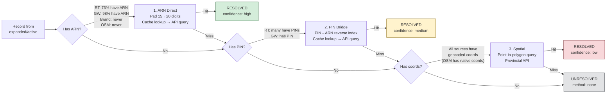
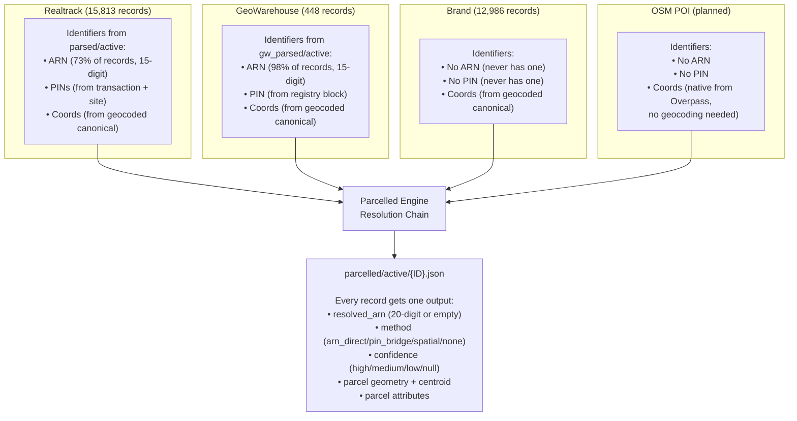
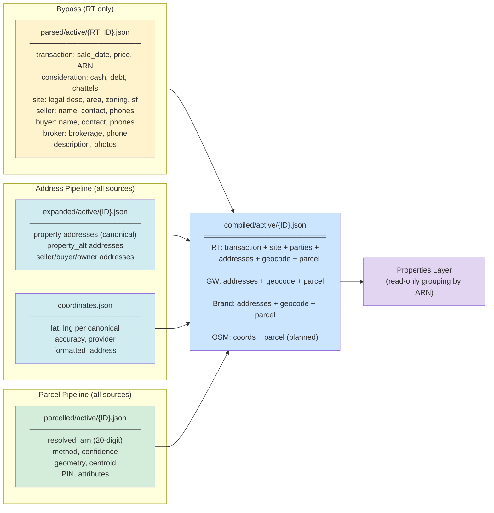

# Pipeline Architecture — All Sources Through Parcelled + Compiled

## Full Pipeline Flow

```mermaid
flowchart LR
    subgraph Sources
        RT["Realtrack.com<br/>~92K HTML files"]
        GW["GeoWarehouse<br/>798 HTML files"]
        BR["Brand APIs<br/>94 brands"]
        OSM["OSM Overpass<br/>(planned)"]
    end

    subgraph "Stage 1 — Parse"
        RT -->|"cleo scrape"| HTML["data/html/{type}/*.html"]
        HTML -->|"cleo parse"| PARSED["parsed/active/<br/>15,813 RT records"]
        GW -->|"cleo gw-ingest"| GWHTML["data/gw_html/*.html"]
        GWHTML -->|"cleo gw-parse"| GWPARSED["gw_parsed/active/<br/>448 GW records"]
        BR -->|"brands/run.py"| BRDATA["brands/data/*.json<br/>~14,340 locations"]
    end

    subgraph "Stage 2 — Normalize"
        PARSED -->|address fields| NORM
        GWPARSED -->|address fields| NORM
        BRDATA -->|address fields| NORM
        NORM["cleo normalize<br/>normalized/active/<br/>29,247 records"]
    end

    subgraph "Stage 3 — Expand"
        NORM -->|"cleo expand"| EXP["expanded/active/<br/>29,247 records<br/>~64K address entries"]
    end

    subgraph "Stage 4 — Geocode"
        EXP -->|canonical addresses| GEO["cleo geocode<br/>coordinates.json<br/>47,371 unique addresses"]
    end

    subgraph "Stage 5 — Parcelled"
        direction TB
        EXP -->|"record IDs + source"| PARCEL_ENGINE
        GEO -->|"coords per canonical"| PARCEL_ENGINE
        PARSED -.->|"RT: ARN, PINs"| PARCEL_ENGINE
        GWPARSED -.->|"GW: ARN, PIN"| PARCEL_ENGINE
        OSM -.->|"OSM: coords only<br/>(planned)"| PARCEL_ENGINE

        PARCEL_ENGINE["cleo parcelled<br/>Resolution Engine"]

        PARCEL_ENGINE -->|"ARN direct"| PROV["Provincial GIS API<br/>(AgMaps MapServer)"]
        PARCEL_ENGINE -->|"PIN bridge"| PROV
        PARCEL_ENGINE -->|"Spatial query"| PROV
        PROV -->|"parcel boundary + ARN"| CACHE["parcel_cache.json<br/>(permanent, grows)"]
        CACHE --> PARCELLED["parcelled/active/<br/>29,247+ records<br/>Each has: resolved ARN,<br/>method, geometry, centroid"]
    end

    subgraph "Stage 6 — Compile"
        PARSED -.->|"bypass: transaction,<br/>parties, site, broker,<br/>description, photos"| COMPILER
        EXP -->|"addresses"| COMPILER
        GEO -->|"lat/lng per address"| COMPILER
        PARCELLED -->|"parcel data"| COMPILER

        COMPILER["cleo compile<br/>compiled/active/<br/>29,247+ records"]
    end

    subgraph "Read Layer"
        COMPILER --> PROPS["Properties<br/>(grouped by ARN)"]
    end

    style Sources fill:#f0f0f0,stroke:#999
    style PARCEL_ENGINE fill:#fff3cd,stroke:#ffc107
    style PROV fill:#d1ecf1,stroke:#0c5460
    style CACHE fill:#d4edda,stroke:#155724
    style PARCELLED fill:#d4edda,stroke:#155724
    style COMPILER fill:#cce5ff,stroke:#004085
    style PROPS fill:#e2d5f1,stroke:#6f42c1
```

## Resolution Priority Chain (per record)

## What Each Source Carries Into the Parcelled Stage

## Compiled Record Assembly

## OSM POI Entry Point (Planned)

OSM POIs skip Parse → Normalize → Expand → Geocode because they already have
coordinates from OpenStreetMap. They enter directly at the Parcelled stage.

```mermaid
flowchart LR
    OVERPASS["Overpass API<br/>All branded/named POIs<br/>in Ontario"] -->|"cleo osm-snapshot"| SNAPSHOT["osm_pois/active/<br/>OSM_00001.json<br/>OSM_00002.json<br/>..."]

    SNAPSHOT -->|"coords only<br/>(no ARN, no PIN)"| PARCELLED["Parcelled Engine<br/>(spatial resolution only)"]

    PARCELLED -->|"Provincial API<br/>point query"| RESULT["parcelled/active/OSM_00001.json<br/>resolved_arn, geometry, centroid"]

    RESULT --> COMPILE["Compiled<br/>compiled/active/OSM_00001.json<br/>source: osm<br/>parcel + brand + coords"]

    COMPILE --> PROPS["Properties<br/>(linked via ARN)"]

    style SNAPSHOT fill:#e8f5e9
    style PARCELLED fill:#fff3cd
    style COMPILE fill:#cce5ff
    style PROPS fill:#e2d5f1
```

## Source ID Schemes

| Source | ID Format | Example | Count |
|--------|-----------|---------|-------|
| Realtrack | RT{digits} | RT100008 | 15,813 |
| GeoWarehouse | GW{5-digit} | GW00001 | 448 |
| Brand | BR_{5-digit} | BR_00001 | 12,986 |
| OSM POI | OSM_{5-digit} | OSM_00001 | (planned) |

All sources converge at the parcelled stage. All get compiled.
All link to properties via the 20-digit ARN.
