# Realtrack Field Flow — Every Field, Every Stage

```mermaid
flowchart LR
    classDef stage fill:#e8b4f8,stroke:#c77ddb,color:#000,font-weight:bold
    classDef fields fill:#fff,stroke:#ccc,color:#333
    classDef process fill:#f0c0e8,stroke:#d090c0,color:#000,font-weight:bold
    classDef compiled fill:#d4edda,stroke:#8fbd9f,color:#000,font-weight:bold
    classDef geocode fill:#d1ecf1,stroke:#8fc5d1,color:#000
    classDef parcel fill:#fff3cd,stroke:#c0a84e,color:#000
    classDef bypass fill:#f8f9fa,stroke:#ccc,color:#666

    %% =====================================================================
    %% SOURCE
    %% =====================================================================
    SCRAPE(["Scrape Realtrack"]):::stage
    SCRAPE --> PARSE(["Parse HTML"]):::stage

    %% =====================================================================
    %% PARSED — branches into field groups
    %% =====================================================================
    PARSE --> P_ID(["Identification"]):::stage
    PARSE --> P_PROP(["Property Address"]):::stage
    PARSE --> P_ALT(["Alternate Addresses"]):::stage
    PARSE --> P_SELL_A(["Seller Address"]):::stage
    PARSE --> P_BUY_A(["Buyer Address"]):::stage
    PARSE --> P_TXN(["Transaction Data"]):::stage
    PARSE --> P_SITE(["Site Facts"]):::stage
    PARSE --> P_CONSID(["Consideration"]):::stage
    PARSE --> P_SELLER(["Seller Details"]):::stage
    PARSE --> P_BUYER(["Buyer Details"]):::stage
    PARSE --> P_BROKER(["Broker"]):::stage
    PARSE --> P_OTHER(["Other"]):::stage

    %% — Identification fields
    P_ID --> P_ID_F["rt_id
    source_version"]:::fields

    %% — Property Address (parsed)
    P_PROP --> P_PROP_F["transaction.address.address
    transaction.address.address_suite
    transaction.address.city
    transaction.address.municipality
    transaction.address.province
    transaction.address.postal_code"]:::fields

    %% — Alternate Addresses (parsed, when present)
    P_ALT --> P_ALT_F["transaction.address
    .alternate_addresses[]
    (raw strings)"]:::fields

    %% — Seller Address (parsed — single raw string)
    P_SELL_A --> P_SELL_A_F["transferor.address
    (single raw string)"]:::fields

    %% — Buyer Address (parsed — single raw string)
    P_BUY_A --> P_BUY_A_F["transferee.address
    (single raw string)"]:::fields

    %% — Transaction Data (bypass)
    P_TXN --> P_TXN_F["sale_date
    sale_date_iso
    sale_price
    sale_price_raw
    arn
    pins[]
    rt_number"]:::bypass

    %% — Site Facts (bypass)
    P_SITE --> P_SITE_F["legal_description
    site_area
    site_area_units
    site_frontage
    site_frontage_units
    site_depth
    site_depth_units
    zoning"]:::bypass

    %% — Consideration (bypass)
    P_CONSID --> P_CONSID_F["cash
    assumed_debt
    chattels
    verbatim
    chargees[]"]:::bypass

    %% — Seller Details (bypass)
    P_SELLER --> P_SELLER_F["transferor.name
    transferor.contact
    transferor.phone
    transferor.attention
    transferor.aliases[]
    transferor.alternate_names[]
    transferor.company_lines[]
    transferor.contact_lines[]
    transferor.address_lines[]
    transferor.phones[]
    transferor.officer_titles[]"]:::bypass

    %% — Buyer Details (bypass)
    P_BUYER --> P_BUYER_F["transferee.name
    transferee.contact
    transferee.phone
    transferee.attention
    transferee.aliases[]
    transferee.alternate_names[]
    transferee.company_lines[]
    transferee.contact_lines[]
    transferee.address_lines[]
    transferee.phones[]
    transferee.officer_titles[]"]:::bypass

    %% — Broker (bypass)
    P_BROKER --> P_BROKER_F["broker.brokerage
    broker.phone"]:::bypass

    %% — Other (bypass)
    P_OTHER --> P_OTHER_F["export_extras.building_sf
    export_extras.postal_code
    description
    photos[]"]:::bypass

    %% =====================================================================
    %% NORMALIZE — decompose raw strings into structured fields
    %% =====================================================================
    P_PROP_F --> NORM(["Normalize Address"]):::process
    P_ALT_F --> NORM
    P_SELL_A_F --> NORM
    P_BUY_A_F --> NORM

    %% — Property (normalized)
    NORM --> N_PROP_F["property.raw_address
    property.street_number
    property.street_name
    property.street_suffix
    property.street_direction
    property.unit
    property.unit_type
    property.po_box
    property.rural_route
    property.building_name
    property.normalized_city
    property.city_status
    property.address_scope
    property.category
    property.normalized_province
    property.raw_city
    property.municipality"]:::fields

    %% — Property Alt (normalized, when present)
    NORM --> N_ALT_F["property_alt[].raw_address
    property_alt[].street_number
    property_alt[].street_name
    property_alt[].street_suffix
    property_alt[].street_direction
    property_alt[].unit
    property_alt[].unit_type
    property_alt[].po_box
    property_alt[].rural_route
    property_alt[].building_name
    property_alt[].normalized_city
    property_alt[].city_status
    property_alt[].address_scope
    property_alt[].category
    property_alt[].normalized_province
    property_alt[].raw_city
    property_alt[].municipality"]:::fields

    %% — Seller (normalized)
    NORM --> N_SELL_F["seller.raw_address
    seller.street_number
    seller.street_name
    seller.street_suffix
    seller.street_direction
    seller.unit
    seller.unit_type
    seller.po_box
    seller.rural_route
    seller.building_name
    seller.normalized_city
    seller.city_status
    seller.address_scope
    seller.category
    seller.normalized_province
    seller.normalized_postal_code"]:::fields

    %% — Buyer (normalized)
    NORM --> N_BUY_F["buyer.raw_address
    buyer.street_number
    buyer.street_name
    buyer.street_suffix
    buyer.street_direction
    buyer.unit
    buyer.unit_type
    buyer.po_box
    buyer.rural_route
    buyer.building_name
    buyer.normalized_city
    buyer.city_status
    buyer.address_scope
    buyer.category
    buyer.normalized_province
    buyer.normalized_postal_code"]:::fields

    %% =====================================================================
    %% EXPAND — split compounds, build canonical, prepare for geocode
    %% =====================================================================
    N_PROP_F --> EXPAND(["Expand Address"]):::process
    N_ALT_F --> EXPAND
    N_SELL_F --> EXPAND
    N_BUY_F --> EXPAND

    %% — Property (expanded — array of addresses)
    EXPAND --> E_PROP_F["property.addresses[].street_number
    property.addresses[].street_name
    property.addresses[].street_suffix
    property.addresses[].street_direction
    property.addresses[].unit
    property.addresses[].unit_type
    property.addresses[].city
    property.addresses[].province
    property.addresses[].postal_code
    property.addresses[].canonical ★
    property.addresses[].skip_geocode ★"]:::fields

    %% — Property Alt (expanded)
    EXPAND --> E_ALT_F["property_alt[].addresses[]
    (same fields as property)"]:::fields

    %% — Seller (expanded)
    EXPAND --> E_SELL_F["seller.addresses[].street_number
    seller.addresses[].street_name
    seller.addresses[].street_suffix
    seller.addresses[].street_direction
    seller.addresses[].unit
    seller.addresses[].unit_type
    seller.addresses[].city
    seller.addresses[].province
    seller.addresses[].postal_code
    seller.addresses[].canonical ★
    seller.addresses[].skip_geocode ★"]:::fields

    %% — Buyer (expanded)
    EXPAND --> E_BUY_F["buyer.addresses[].street_number
    buyer.addresses[].street_name
    buyer.addresses[].street_suffix
    buyer.addresses[].street_direction
    buyer.addresses[].unit
    buyer.addresses[].unit_type
    buyer.addresses[].city
    buyer.addresses[].province
    buyer.addresses[].postal_code
    buyer.addresses[].canonical ★
    buyer.addresses[].skip_geocode ★"]:::fields

    %% =====================================================================
    %% GEOCODE — canonical string → coordinates
    %% =====================================================================
    E_PROP_F --> GEO(["Geocode"]):::process
    E_ALT_F --> GEO
    E_SELL_F --> GEO
    E_BUY_F --> GEO

    GEO --> G_RESULT["per canonical address:
    ———————————
    mapbox.lat ★
    mapbox.lng ★
    mapbox.accuracy ★
    mapbox.geocoded_at ★
    mapbox.formatted_address ★
    mapbox.mapbox_id ★
    mapbox.match_code:
      .address_number ★
      .street ★
      .postcode ★
      .place ★
      .region ★
      .locality ★
      .country ★
      .confidence ★"]:::geocode

    %% =====================================================================
    %% PARCEL LOOKUP — property coords/ARN → parcel boundary
    %% (property address only, not seller/buyer)
    %% =====================================================================
    G_RESULT --> PCL{{"Parcel Lookup
    (property only)"}}:::process

    PCL --> PCL_MATCH["property_parcel_index:
    ———————————
    parcel_arn ★
    method ★
    zoning ★"]:::parcel

    PCL --> PCL_FEAT["parcels.json feature:
    ———————————
    arn ★
    pcl_id ★
    address ★
    city ★
    assessment ★
    property_use ★
    legal_desc ★
    area_sqm ★
    municipality ★
    centroid_lat ★
    centroid_lng ★
    geometry ★"]:::parcel

    PCL --> PCL_PROV["provincial parcel:
    ———————————
    ASSESSMENT_ROLL_NUMBER ★
    OGF_ID ★
    query_lat ★
    query_lng ★
    source ★"]:::parcel

    %% =====================================================================
    %% COMPILED RT RECORD — everything reassembled
    %% =====================================================================
    P_ID_F --> COMPILED(["Compiled RT Record"]):::compiled
    G_RESULT --> COMPILED
    PCL_MATCH --> COMPILED
    PCL_FEAT --> COMPILED
    P_TXN_F -.-> COMPILED
    P_SITE_F -.-> COMPILED
    P_CONSID_F -.-> COMPILED
    P_SELLER_F -.-> COMPILED
    P_BUYER_F -.-> COMPILED
    P_BROKER_F -.-> COMPILED
    P_OTHER_F -.-> COMPILED

    COMPILED --> C_FIELDS["=== IDENTIFICATION ===
    rt_id, source
    ···························
    === PROPERTY ADDRESS ===
    (from expand + geocode)
    addresses[]: canonical, components,
      lat, lng, accuracy, confidence,
      formatted_address, mapbox_id
    ···························
    === PROPERTY ALT ===
    (when present, same as above)
    ···························
    === SELLER ADDRESS ===
    (from expand + geocode)
    addresses[]: canonical, components,
      lat, lng, accuracy, confidence,
      formatted_address, mapbox_id
    ···························
    === BUYER ADDRESS ===
    (from expand + geocode)
    addresses[]: canonical, components,
      lat, lng, accuracy, confidence,
      formatted_address, mapbox_id
    ···························
    === PARCEL ===
    parcel_arn, pcl_id, assessment,
    property_use, area_sqm, zoning,
    legal_desc, geometry
    ···························
    === TRANSACTION (bypass) ===
    sale_date, sale_date_iso,
    sale_price, sale_price_raw,
    arn, pins[]
    ···························
    === SITE (bypass) ===
    legal_description,
    site_area, site_frontage, site_depth,
    zoning
    ···························
    === CONSIDERATION (bypass) ===
    cash, assumed_debt, chattels,
    verbatim, chargees[]
    ···························
    === SELLER PARTY (bypass) ===
    name, contact, phone, attention,
    aliases[], company_lines[],
    contact_lines[], phones[],
    officer_titles[]
    ···························
    === BUYER PARTY (bypass) ===
    (same structure as seller)
    ···························
    === BROKER (bypass) ===
    brokerage, phone
    ···························
    === OTHER (bypass) ===
    building_sf, description, photos[]"]:::compiled

    %% =====================================================================
    %% PROPERTY MATCHING — after compilation
    %% =====================================================================
    C_FIELDS --> MATCH{{"Match to Property
    (new or existing P-ID)"}}:::process
    MATCH --> PROP_REG(["Property Registry
    properties.json"]):::stage
```

## Key

- **Solid arrows** (→) = data flows through address pipeline (normalize → expand → geocode)
- **Dashed arrows** (⇢) = bypass — fields skip the address pipeline and go directly to compiled record
- **★** = field is NEW at this stage (did not exist in prior stages)
- All address roles (property, seller, buyer, property_alt) flow through the same Normalize → Expand → Geocode path
- Only the **property address** goes through Parcel Lookup (seller/buyer addresses don't need parcels)

## Field Counts by Stage

| Stage | What Happens | Fields In | New Fields |
|-------|-------------|-----------|------------|
| **Parsed** | Extract from HTML | 62 total | 62 (all raw) |
| **Normalized** | Decompose addresses, standardize | 17 per address role | +10 (street components, city_status, category, scope) |
| **Expanded** | Split compounds, build canonical | 11 per address entry | +2 (canonical, skip_geocode) |
| **Geocoded** | Canonical → coordinates | 15 per address | +15 (lat, lng, accuracy, formatted_address, mapbox_id, match_code.*) |
| **Parcel** | Coords/ARN → boundary | 11 per property | +11 (assessment, property_use, area_sqm, etc.) |
| **Compiled** | Reassemble all paths | ~100+ | 0 (assembly only) |

## What Bypasses the Address Pipeline

These parsed fields are NOT addresses — they skip normalize/expand/geocode and go directly to the compiled record:

- **Transaction Data**: sale_date, sale_date_iso, sale_price, sale_price_raw, arn, pins[], rt_number
- **Site Facts**: legal_description, site_area/units, site_frontage/units, site_depth/units, zoning
- **Consideration**: cash, assumed_debt, chattels, verbatim, chargees[]
- **Seller Party**: name, contact, phone, attention, aliases[], company_lines[], contact_lines[], address_lines[], phones[], officer_titles[], alternate_names[]
- **Buyer Party**: (same structure as seller)
- **Broker**: brokerage, phone
- **Other**: building_sf, postal_code, description, photos[]

## Notes

1. **Normalize** field differences by role:
   - **Property** has `raw_city` + `municipality` (from parsed structured fields)
   - **Seller/Buyer** have `normalized_postal_code` (extracted from raw string)
   - **Property** does NOT have `normalized_postal_code` (parsed postal_code is usually empty)

2. **Expand** restructures data: single address object → `addresses[]` array (because compound addresses like "10-12 Main St" split into multiple entries)

3. **Geocode** is keyed by the `canonical` string from expand — not by RT ID. The link back is: RT ID → expanded canonical → coordinates.json lookup

4. **Parcel Lookup** uses property coordinates OR the parsed ARN for direct matching. Only property addresses get parcel data — seller/buyer addresses are mailing addresses, not real estate parcels.

5. The **Compiled RT Record** does not exist yet — this chart shows what SHOULD be assembled. Currently, a subset ends up in `properties.json` but many fields (consideration, party details, site measurements) are not carried forward.
