# Cleo Mini V3 — System Flowchart

**Last updated:** 2026-03-01

The full machine: three data sources, a versioned pipeline, enrichment layers, registries, a review UI, and a React frontend.

```mermaid
flowchart TD

  %% ── Styling ──
  classDef source fill:#e8daef,stroke:#7d3c98,color:#000
  classDef storage fill:#d5f5e3,stroke:#27ae60,color:#000
  classDef engine fill:#d6eaf8,stroke:#2980b9,color:#000
  classDef versioned fill:#fdebd0,stroke:#e67e22,color:#000
  classDef output fill:#fadbd8,stroke:#e74c3c,color:#000
  classDef enrich fill:#fef9e7,stroke:#f39c12,color:#000
  classDef web fill:#ebdef0,stroke:#8e44ad,color:#000
  classDef review fill:#f2f3f4,stroke:#95a5a6,color:#555
  classDef validate fill:#fcf3cf,stroke:#d4ac0d,color:#000

  %% ════════════════════════════════════════════════════
  %%  LAYER 1 — DATA SOURCES
  %% ════════════════════════════════════════════════════

  subgraph SOURCES ["Data Sources"]
    direction LR

    subgraph RT_SRC ["Realtrack.com"]
      RT_SITE(("Realtrack.com<br/>Ontario CRE sales")):::source
      RT_SCRAPE["cleo scrape --type X<br/>9 property types"]:::engine
      RT_HTML[("data/html/{type}/*.html<br/>92,547 files")]:::storage
      RT_INDEX["cleo rebuild-html-index<br/>→ html_index.json"]:::engine
      RT_TRACK[("seen_rt_ids.json<br/>v2: {rt_id: {ts, type}}")]:::storage

      RT_SITE --> RT_SCRAPE --> RT_HTML
      RT_SCRAPE --> RT_TRACK
      RT_HTML --> RT_INDEX
    end

    subgraph BR_SRC ["Brand Scrapers"]
      BR_APIS(("94 Brand APIs<br/>& Websites")):::source
      BR_RUN["brands/run.py<br/>35 scraper modules<br/>no HTML saved"]:::engine
      BR_JSON[("brands/data/*.json<br/>14,340 stores")]:::storage

      BR_APIS --> BR_RUN --> BR_JSON
    end

    subgraph GW_SRC ["GeoWarehouse"]
      GW_EXT(("Browser Extension<br/>MPAC property data")):::source
      GW_INGEST["cleo gw-ingest"]:::engine
      GW_HTML[("data/gw_html/*.html<br/>798 files")]:::storage

      GW_EXT --> GW_INGEST --> GW_HTML
    end
  end

  %% ════════════════════════════════════════════════════
  %%  LAYER 2 — PARSING
  %% ════════════════════════════════════════════════════

  subgraph PARSE_LAYER ["Stage 1: Parse"]
    direction LR

    RT_PARSE["cleo parse<br/>--sandbox / --promote<br/>27 sub-parsers"]:::engine
    RT_PARSED[("data/parsed/active/<br/>RT*.json — 15,813 records<br/>v014")]:::versioned

    GW_PARSE["cleo gw-parse<br/>--sandbox / --promote<br/>BeautifulSoup"]:::engine
    GW_PARSED[("data/gw_parsed/active/<br/>GW*.json — 448 properties<br/>v001")]:::versioned

    RT_PARSE --> RT_PARSED
    GW_PARSE --> GW_PARSED
  end

  RT_HTML --> RT_PARSE
  GW_HTML --> GW_PARSE

  %% ════════════════════════════════════════════════════
  %%  LAYER 2b — VALIDATION
  %% ════════════════════════════════════════════════════

  subgraph VALIDATE_LAYER ["Validation"]
    direction LR

    HTML_CHK["cleo validate<br/>14 HTML checks (H001-H014)"]:::validate
    HTML_FLAGS[("html_flags.json")]:::storage
    PARSE_CHK["cleo parse-check<br/>10 parse checks (P001-P010)"]:::validate
    PARSE_FLAGS[("parse_flags.json")]:::storage

    HTML_CHK --> HTML_FLAGS
    PARSE_CHK --> PARSE_FLAGS
  end

  RT_HTML --> HTML_CHK
  RT_PARSED --> PARSE_CHK

  %% ════════════════════════════════════════════════════
  %%  LAYER 3 — NORMALIZE
  %% ════════════════════════════════════════════════════

  subgraph NORM_LAYER ["Stage 2: Normalize"]
    NORM_ENGINE["cleo normalize<br/>--sandbox / --promote<br/>3 entry points:<br/>normalize_from_fields (RT, brands)<br/>normalize_from_string (parties)<br/>normalize_from_mpac (GW)"]:::engine
    AMO_LIST[("municipalities.json<br/>414 AMO municipalities<br/>+ 263 aliases")]:::storage
    NORM_STORE[("data/normalized/active/<br/>RT + BR + GW records<br/>29,247 records — v019")]:::versioned

    AMO_LIST -.-> NORM_ENGINE
    NORM_ENGINE --> NORM_STORE
  end

  RT_PARSED -- "addresses" --> NORM_ENGINE
  BR_JSON -- "addresses" --> NORM_ENGINE
  GW_PARSED -- "addresses" --> NORM_ENGINE

  %% ════════════════════════════════════════════════════
  %%  LAYER 4 — EXPAND
  %% ════════════════════════════════════════════════════

  subgraph EXPAND_LAYER ["Stage 3: Expand"]
    EXPAND_ENGINE["cleo expand<br/>--sandbox / --promote<br/>compound splitting<br/>postal code decomposition"]:::engine
    EXP_STORE[("data/expanded/active/<br/>64,244 address entries<br/>v004")]:::versioned

    EXPAND_ENGINE --> EXP_STORE
  end

  NORM_STORE --> EXPAND_ENGINE

  %% ════════════════════════════════════════════════════
  %%  LAYER 5 — GEOCODE
  %% ════════════════════════════════════════════════════

  subgraph GEO_LAYER ["Stage 4: Geocode"]
    GEO_COLLECT["cleo geocode --collect<br/>unified_collector.py<br/>priority-tagged addresses"]:::engine
    GEO_BATCH["cleo geocode --sync<br/>Mapbox / HERE / Geocodio<br/>batch geocoding"]:::engine
    GEO_STORE[("data/coordinates.json<br/>~50K entries<br/>multi-provider, best_coords()")]:::storage
    GEO_INDEX["cleo geocode --build-index"]:::engine
    ADDR_INDEX[("address_index.json<br/>address → RT IDs + roles")]:::storage

    GEO_COLLECT --> GEO_BATCH --> GEO_STORE
    GEO_STORE --> GEO_INDEX --> ADDR_INDEX
  end

  EXP_STORE --> GEO_COLLECT

  %% ════════════════════════════════════════════════════
  %%  LAYER 6 — REGISTRIES
  %% ════════════════════════════════════════════════════

  subgraph REGISTRIES ["Registries"]
    direction LR

    PROP_BUILD["cleo properties<br/>dedup by (address, city)<br/>stable P-IDs (P00001+)"]:::engine
    PROP_REG[("data/properties.json<br/>19,741 properties<br/>transactions attached")]:::output

    PARTY_BUILD["cleo parties<br/>union-find clustering<br/>stable G-IDs (G00001+)"]:::engine
    PARTY_REG[("data/parties.json<br/>16,839 groups")]:::output
    PARTY_CONFIRM["cleo auto-confirm"]:::engine

    PROP_BUILD --> PROP_REG
    PARTY_BUILD --> PARTY_REG
    PARTY_REG --> PARTY_CONFIRM --> PARTY_REG
  end

  RT_PARSED -- "non-address data<br/>(price, date, parties,<br/>ARN, brokerage)" --> PROP_BUILD
  GW_PARSED -- "non-address data<br/>(PIN, ARN, zoning,<br/>assessment)" --> PROP_BUILD
  GEO_STORE -- "coordinates" --> PROP_BUILD
  RT_PARSED -- "party names,<br/>phones, addresses" --> PARTY_BUILD
  PROP_REG -- "cross-ref" --> PARTY_BUILD

  %% ════════════════════════════════════════════════════
  %%  LAYER 7 — ENRICHMENTS
  %% ════════════════════════════════════════════════════

  subgraph ENRICHMENTS ["Enrichment Layers"]
    direction LR

    subgraph PARCELS ["Parcels"]
      PARCEL_HARVEST["cleo parcels --build<br/>Municipal ArcGIS (5 cities)<br/>Provincial MapServer (32 cities)"]:::enrich
      PARCEL_STORE[("data/parcels/<br/>PCL_NNNNN IDs<br/>boundaries + zoning")]:::storage
      PARCEL_MATCH["cleo parcel-match<br/>brand POI → parcel<br/>→ property"]:::enrich

      PARCEL_HARVEST --> PARCEL_STORE --> PARCEL_MATCH
    end

    subgraph STREETVIEW ["Google Street View"]
      SV_FETCH["On-demand fetch<br/>via API endpoint<br/>BudgetGuardian (9K/mo)"]:::enrich
      SV_CACHE[("data/streetview/<br/>{prop_id}.jpg")]:::storage

      SV_FETCH --> SV_CACHE
    end

    subgraph BRANDS_MATCH ["Brand Matching"]
      BR_MATCH["brands/match.py<br/>street number + city<br/>+ fuzzy street name"]:::enrich
      BR_MATCHES[("brand_matches.json<br/>7,881 matched")]:::storage
      BR_UNMATCHED[("brand_unmatched.json<br/>4,257 unmatched")]:::storage

      BR_MATCH --> BR_MATCHES
      BR_MATCH --> BR_UNMATCHED
    end

    subgraph GW_MATCH_SUB ["GW Matching"]
      GW_MATCH["cleo gw-match<br/>GW record → property<br/>by address/PIN"]:::enrich
    end
  end

  GEO_STORE -- "coords" --> PARCEL_HARVEST
  PROP_REG -- "properties" --> PARCEL_HARVEST
  BR_JSON -- "store locations" --> BR_MATCH
  PROP_REG -- "properties" --> BR_MATCH
  BR_JSON -- "store locations" --> PARCEL_MATCH
  GW_PARSED --> GW_MATCH
  PROP_REG --> GW_MATCH
  PARCEL_MATCH --> PROP_REG
  BR_MATCHES --> PROP_REG
  GW_MATCH --> PROP_REG

  %% ════════════════════════════════════════════════════
  %%  LAYER 8 — WEB / API / FRONTEND
  %% ════════════════════════════════════════════════════

  subgraph WEB_LAYER ["Web Layer"]
    direction LR

    FASTAPI["cleo web<br/>FastAPI :8099<br/>55+ endpoints"]:::web

    subgraph REVIEW_UI ["Review UI (localhost:8099)"]
      direction TB
      REV_LANDING["/review — landing"]:::review
      REV_PARSE["/review/parse<br/>HTML | Active | Sandbox"]:::review
      REV_NORM["/review/normalize<br/>Parsed | Active | Sandbox"]:::review
      REV_EXPAND["/review/expand<br/>Normalized | Active | Sandbox"]:::review
      REV_PIPELINE["/pipeline<br/>HTML | Parsed | Extracted | Geocoded"]:::review
    end

    subgraph FRONTEND ["React SPA (localhost:5173 → :8099)"]
      direction TB
      FE_DASH["/dashboard<br/>metrics + recent"]:::web
      FE_TX["/transactions<br/>TanStack table + detail"]:::web
      FE_PARCELS["/parcels<br/>ARN-centric grid + detail"]:::web
      FE_MAP["/map<br/>Mapbox GL<br/>parcels + properties"]:::web
      FE_ADMIN["/admin<br/>data management"]:::web
    end
  end

  PROP_REG --> FASTAPI
  PARTY_REG --> FASTAPI
  GEO_STORE --> FASTAPI
  PARCEL_STORE --> FASTAPI
  BR_MATCHES --> FASTAPI
  SV_CACHE --> FASTAPI

  FASTAPI --> REVIEW_UI
  FASTAPI --> FRONTEND

  %% ════════════════════════════════════════════════════
  %%  REVIEW FEEDBACK LOOPS (dotted lines)
  %% ════════════════════════════════════════════════════

  REV_PARSE -. "reviews.json<br/>clean / bad_source /<br/>parser_issue" .-> RT_PARSE
  REV_NORM -. "norm_reviews.json" .-> NORM_ENGINE
  REV_EXPAND -. "expand_reviews.json" .-> EXPAND_ENGINE

  %% ════════════════════════════════════════════════════
  %%  VERSIONING NOTE
  %% ════════════════════════════════════════════════════

  subgraph VERSION_PATTERN ["Versioning Pattern (all stages)"]
    direction LR
    V_SANDBOX["--sandbox<br/>write to sandbox/"]:::engine
    V_DIFF["--diff<br/>compare to active"]:::engine
    V_PROMOTE["--promote<br/>sandbox → v00N<br/>active → v00N"]:::engine
    V_GATE{"Regression<br/>gate"}:::validate
    V_ROLLBACK["--rollback-to v00N"]:::engine

    V_SANDBOX --> V_DIFF --> V_GATE
    V_GATE -- "pass" --> V_PROMOTE
    V_GATE -- "fail" --> V_ROLLBACK
  end
```

## Reading the Chart

**Colors:**
- Purple circles = external data sources
- Blue boxes = CLI commands / engines
- Green cylinders = raw data files / caches
- Orange cylinders = versioned stage output (immutable snapshots)
- Red cylinders = final registry output
- Yellow boxes = enrichment modules
- Light purple boxes = web / frontend
- Grey boxes = review UI pages

**Flow direction:** Top to bottom. Data enters at the top (sources), flows through versioned stages, builds into registries, gets enriched, and is served by the web layer at the bottom.

**Dotted lines** = review feedback loops. Human review determinations flow back into the next sandbox run as regression gates.

**"Other Data" bypass:** Non-address data (price, date, parties, ARN, zoning) skips the normalize/expand pipeline and goes directly from parsed output into the property registry builder.

## Key Numbers

| Layer | Count |
|---|---|
| HTML files scraped | 92,547 |
| Parsed RT records | 15,813 |
| Brand store locations | 14,340 (94 brands) |
| GeoWarehouse properties | 448 (by PIN) |
| Normalized records | 29,247 (all 3 sources) |
| Expanded address entries | 64,244 |
| Geocoded coordinates | ~50,000 |
| Unique properties | 19,741 |
| Party groups | 16,839 |
| Brand-matched properties | 7,881 |
| API endpoints | 55+ |
